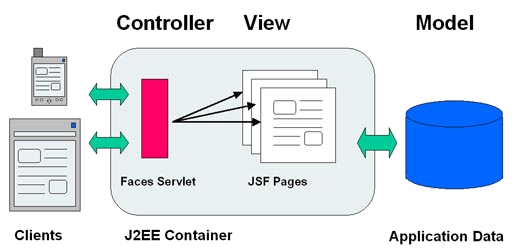

% JSF
% Adolfo Sanz De Diego
% Junio 2013

# Acerca de

## Pronoide

Pronoide consolida sus servicios de formación superando
  las **22.000 horas impartidas** en más de 500 cursos (Diciembre 2011)

En la vorágine de **tecnologías y marcos de trabajo existentes**
  **para la plataforma Java**, una empresa dedica demasiado esfuerzo en
  analizar, comparar y finalmente decidir cuáles son los
  pilares sobre los que construir sus proyectos.

Nuestros Servicios de Formación Java permiten ayudarle en esta tarea,
  transfiriéndoles nuestra **experiencia real de más de 10 años**.

## Autor

**Adolfo Sanz De Diego**

-  Correo: [asanzdiego@gmail.com](mailto:asanzdiego@gmail.com)

-  Twitter: [@asanzdiego](http://twitter.com/asanzdiego)

-  Linkedin: [http://www.linkedin.com/in/asanzdiego](http://www.linkedin.com/in/asanzdiego)

-  Blog: [http://asanzdiego.blogspot.com.es](http://asanzdiego.blogspot.com.es)

## Licencia

**Este obra está bajo una licencia:**

-  [Creative Commons Reconocimiento-CompartirIgual 3.0](http://creativecommons.org/licenses/by-sa/3.0/es/)

**El código fuente de los programas están bajo una licencia:**

-  [GPL 3.0](http://www.viti.es/gnu/licenses/gpl.html)

# Introducción

## Objetivo

El objetivo de JSF es **desarrollar aplicaciones web** de forma parecida
  a como se construyen **aplicaciones de escritorio** con Swing, AWT, SWT.

JSF gestiona las acciones producidas por el usuario en su página HTML,
  las traduce a **eventos que son enviados al servidor**,
  y regenera la página original con los cambios provocados por dichas acciones.

## Características

Representar componentes de interfaz de usuario y manejar su estado.

Manejar eventos.

Validar y convertir datos.

Definir la navegación entre páginas.

Soportar internacionalización.

Soportar AJAX.

Extender todas estas características.

## Novedades JSF 2.0

Facelets (mecanismo de plantillas).

Soporte nativo Ajax.

Navegación implicita (convención sobre configuración).

Navegación condicional.

Uso intensivo de anotaciones.

Project Stage (etapa del proyecto: desarrollo, producción, etc.)

Mejora de la validación.

Mejora la gestión de errores.

Añadido ResourceBundles como bean.

Carga de recursos (imágenes, CSS, JavaScripts...)

Componentes compuestos

## Implementaciones

<ul>
  <li><strong><a href="http://javaserverfaces.java.net/">Mojarra</a></strong>,
    la implementación de referencia de Oracle 
    </li>
  <li><strong><a href="http://myfaces.apache.org/">MyFaces</a></strong>,
    la implementación de referencia de Apache 
    </li>
</ul>

## Extensiones

## Model-View-Controller

## Arquitectura

Clases Java:

-  Componentes UI
    - estándares: botón, checkbox, label, etc.
    - personalizados: ya sean de librerías externas o propios.

-  FacesServlet (Front Controler declarado en el web.xml)

-  Conversores de tipo

-  Validadores

Tags Libraries:

-  Estándares -> [http://horstmann.com/corejsf/jsf-tags.html](http://horstmann.com/corejsf/jsf-tags.html)

-  Personalidadas.

-  Usadas en JSP y Facelets.

Archivos de configuración (faces-config.xml):

-  Define Managed Beans.

-  Define la navegación entre páginas.

# Instalación

## Mojarra VS MyFaces

Yo voy a usar **MyFaces**, ¿por qué? por, entre otras, estas [10 razones](http://lu4242.blogspot.com.es/2011/06/10-reason-why-choose-myfaces-core-as.html)

## Maven

Buscamos los archetypes de [http://myfaces.apache.org](http://myfaces.apache.org):

~~~
mvn archetype:generate -DarchetypeCatalog=http://myfaces.apache.org
~~~

 Y seleccionamos:

~~~
org.apache.myfaces.buildtools:myfaces-archetype-helloworld20
(Archetype to create a new webapp based on MyFaces 2.0)
~~~

Y respondemos a las preguntas:

~~~
Define value for property 'groupId': : com.company
Define value for property 'artifactId': : project-name
Define value for property 'version':  1.0-SNAPSHOT: :
Define value for property 'package':  com.company: : com.company.proyectname
~~~

## Eclipse

Import...

~~~
Existing Maven Projects
~~~

Añadir dependencias al pom.xml

~~~{.xml}
<dependency>
    <groupId>org.apache.myfaces.core</groupId>
    <artifactId>myfaces-api</artifactId>
    <version>${jsf-myfaces.version}</version>
    <scope>compile</scope>
</dependency>
<dependency>
    <groupId>org.apache.myfaces.core</groupId>
    <artifactId>myfaces-impl</artifactId>
    <version>${jsf-myfaces.version}</version>
    <scope>runtime</scope>
</dependency>
~~~

Botón derecho en el proyecto > Properties > Project Facets

~~~
Configuration: JavaServer Faces 2.1 Project
~~~

Further configuration available

~~~
Content directory: src/main/webapp
~~~

Luego:

~~~
Type: Disable Library Configuration
~~~

Botón derecho en el proyecto > Properties > Deployment Assembly

~~~
Add... > Java Build Path Entries > Maven Dependencies
~~~

## FacesServlet en el web.xml

~~~{.xml}
<!-- Faces Servlet -->
<servlet>
    <servlet-name>Faces Servlet</servlet-name>
    <servlet-class>javax.faces.webapp.FacesServlet</servlet-class>
    <load-on-startup>1</load-on-startup>
</servlet>

<!-- Faces Servlet Mapping -->
<servlet-mapping>
    <servlet-name>Faces Servlet</servlet-name>
    <url-pattern>*.jsf</url-pattern>
</servlet-mapping>

<!-- Welcome files -->
<welcome-file-list>
    <welcome-file>index.html</welcome-file>
</welcome-file-list>
~~~

## Propiedad PROJECT_STAGE del web.xml

~~~{.xml}
<context-param>
    <description>Project stage for the application (new in 2.0). Expects one of
        the following values: Development, Production, SystemTest, UnitTest
    </description>
    <param-name>javax.faces.PROJECT_STAGE</param-name>
    <param-value>Development</param-value>
</context-param>
~~~

Por ejemplo, en MyFaces, si está en modo "Development" usa un página de error
  con mucha información, pero si está en modo "Production" usa las páginas de error
  estándar (404.html, 500.html) que tengas definidas (ya se en servidor de aplicaciones
  o en la propia aplicación)

## Páginas de error

Si quieres definir tus propias páginas de error para tu aplicación (y no usar las
  del servidor de aplicaciones) deberás indicarlo en el web.xml

~~~{.xml}
<error-page>
    <error-code>500</error-code>
    <location>/500.html</location>
</error-page>
~~~

# Managed Beans

## Declaración

Un Managed Bean es simplemente un POJO, que en JSF mapea los datos de una página.

Se pueden configurar mediante **anotaciones** o en **/WEB-INF/faces-config.xml**

~~~{.java}
@ManagedBean(name="holaBean")
@SessionScoped
public class HolaBean implements Serializable {

  private String nombre;

  public holaBean() { }

  // getters y setters
}
~~~

~~~{.xml}
<managed-bean>
  <managed-bean-name>holaBean</managed-bean-name>
  <managed-bean-class>mipaquete.HolaBean</managed-bean-class>
  <managed-bean-scope>session</managed-bean->
</managed-bean>
~~~

## Inicializar propiedades

En \<value> podemos hacer referencia a otro bean con expresiones
  del tipo #{otroBean.otraPropiedad}.

~~~{.java}
@ManagedBean
@SessionScoped
public class UserBean {
  @ManagedProperty(value="Ana")
  private String name
  ...
}
~~~

~~~{.xml}
<managed-bean>
  <managed-bean-name>userBean</managed-bean-name>
  <managed-bean-class>com.examples.UserBean</managed-bean-class>
  <managed-bean-scope>session</managed-bean-scope>
  <managed-property>
    <property-name>name</property-name>
    <value>Ana</value>
  </managed-property>
</managed-bean>
~~~

## Inicializar un array o un List

Sólo desde faces-config.xml

~~~{.xml}
<managed-property>
  <property-name>numHabitaciones</property-name>
  <list-entries>
    <value-class>java.lang.Integer</value-class>
    <value>1</value>
    <value>2</value>
    <value>3</value>
  </list-entries>
</managed-property>
~~~

Para acceder desde nuestra página JSF:

~~~{.xml}
<h:outputText value="#{userBean.numHabitaciones[2]}"/>
~~~

## Inicializar un Map

Sólo desde faces-config.xml

~~~{.xml}
<managed-property>
  <property-name>semaforo</property-name>
  <map-entries>
    <map-entry>
      <key>Rojo</key>
      <value>No puedes continuar</value>
    </map-entry>
    <map-entry>
      <key>Verde</key>
      <value>Puedes continuar</value>
    </map-entry>
  </map-entries>
</managed-property>
~~~

Para acceder desde nuestra página JSF:

~~~{.xml}
<h:outputText value="#{userBean.semaforo['Verde']}"/>
~~~

# Bean Scopes

## Definición

Un scope es un **mapeo entre nombres y objetos** que se almacena durante un determinado periodo de tiempo.

Se recomienda **utilizar siempre el menor scope que necesite el bean**,
  para evitar así posibles problemas de memoria.

Si declaramos el bean desde el fichero faces-config.xml

~~~
<managed-bean-scope>application|session|view|request|none|custom</managed-bean-scope>
~~~

Si queremos hacerlo con anotaciones:

~~~{.java}
@{Application|Session|View|Request|None|Custom}Scoped
~~~

## Application

Con este scope, se guarda la información durante **toda la vida de la aplicación web**,
  independientemente de todas las peticiones y sesiones que se realicen.

Este bean se instancia con la primera petición a la aplicación
  y desaparece cuando la aplicación web se elimina del servidor.

Si queremos que el bean se instancie antes de que se muestre la primera página
  de la aplicación, usamos la propiedad eager a true.

~~~{.xml}
<managed-bean eager="true">
~~~

~~~{.java}
@ManagedBean(eager=true)
~~~

## Session

Este scope guarda la información **desde que el usuario comienza una sesión**
  **hasta que ésta termina** (porque el tiempo expiró o se invocó al método
  invalidate sobre un objeto HttpSession).

HTTP es un protocolo sin estado, y por tanto, una vez que se envía
  una petición al servidor y éste responde, no se guarda ninguna información
  sobre esta transición.

Esto no es siempre adecuado en aplicaciones de lado de servidor,
  ya que es normal que necesiten ir guardando el estado.

Para ello, podemos utilizar:

-  **Cookies**: pares nombre-valor que el servidor envía al usuario,
      confiando en que en posteriores peticiones se la vaya "devolviendo".

-  **URL rewriting**: añade un identificador de sesión a la URL,
      y la sesión se guarda en el servidor.

## View

Este scope **dura desde que se muestra una página JSF al usuario**
  **hasta que el usuario navega hacia otra página**.

Es muy útil para páginas que usan **AJAX**.

## Request

Este scope dura lo que **dura una petición request**.

Comienza cuando se envía una petición al servidor
  y termina cuando se devuelve la respuesta al usuario.

Esto hace que se cree una instancia del bean asociado para cada petición.

Los mensajes de estado y de error que se muestran al usuario
  son buenos candidatos a ser request, ya que se muestran una vez
  que el servidor devuelve la respuesta.

## None

Los beans se instancian cuando son necesitados por otros beans,
  y se eliminan cuando esta necesidad desaparece.

## Custom

También se permite crear scopes personalizados donde el tiempo que dura
  lo definimos nosotros.

La aplicación se vuelve responsable de ir eliminando las instancias de los beans del mapeo.

# Expression Language

## Acceder a las propiedades

Expression Language (EL) **nos permite acceder a las propiedades y a los métodos**
  de los beans.

~~~{.XML}
<h:outputText value="#{userBean.profile}"/>
~~~

Podemos **utilizar operadores** aritméticos, lógicos o comprobar si el valor es empty.

~~~{.XML}
<h:outputText rendered="#{userBean.profile=='VIP'}" value="Bono regalo de #{bono.base-10} Euros"/>
~~~

Podemos **invocar a métodos con parámetros**, siempre que no estén sobrecargados.

~~~{.XML}
<h:commandButton value="Aceptar" action="#{userBean.addText('texto')}"/>
~~~

## Acceder a las propiedades desde Java

~~~{.java}
FacesContext ctx = FacesContext.getCurrentInstance();
Application app = ctx.getApplication( );
~~~

~~~{.java}
ELContext ec = ctx.getELContext( );
String name = (String) app.evaluateValueExpressionGet(ctx,"#{userBean.name}",String.class);
~~~

~~~{.java}
ExpressionFactory ef = app.getExpressionFactory( );
ValueExpression ve =.ef.createValueExpression(ec,"#{userBean.name}",String.class);
name = (String) ve.getValue(ec);
ve.setValue(ec, "Serena");
~~~

~~~{.java}
ExpressionFactory ef = app.getExpressionFactory( );
ValueExpression ve = ef.createValueExpression(ec,"#{userBean}",UserBean.class);
UserBean ub = (UserBean) ve.getValue(ec);
ub.setName("Serena");
~~~

## Objectos implícitos

Son unos objetos que ya vienen predefinidos:

-  **#{application}**: el ServletContext.

-  **#{facesContext}**: el FacesContext actual.

-  **#{session}**: el HttpSession actual.

-  **#{request}**: el HttpServletRequest actual.

-  **#{view}**: el UIViewRoot actual.

-  **#{component}**: el UIComponent actual.

-  **#{flash}**: el Flash, que es un Map.

Son unos objetos que ya vienen predefinidos:

-  **#{applicationScope}**: un map con los atributos del scope aplication actual.

-  **#{sessionScope}**: un map con los atributos de la session actual.

-  **#{requestScope}**: un map con los atributos de la request actual.

-  **#{viewScope}**: un map con los atributos de la view actual.

-  **#{initParam}**: un map con los parámetros del context actual.

-  **#{param}**: un map con los parámetros de la request actual.

-  **#{paramValues}**: un map con los valores de los parámetros de la request actual.

-  **#{header}**: un map con la cabecera de la request actual.

-  **#{headerValues}**: un map con los valores de la cabecera de la request actual.

-  **#{cookie}**: un map con los atributos de la cookie.

# Navegación

## Navegación implícita

**Convención sobre configuración** -> no requiere faces-config.xml.

Si queremos navegar desde question1.xhtml a question2.xhtml, en un link:

~~~{.xml}
<h:commandLink value="Next" action="question2"/>
~~~

Si queremos elegir la página en tiempo de ejecución,
  asociamos el action a un método que nos devuelva el String
  que indicará la siguiente página a mostrar.

~~~{.xml}
<h:commandButton label="Aceptar" action"#{userBean.login}"/>
~~~

~~~{.java}
public String login() {
  return "login";
}
~~~

## Navegación condicional

Podemos decidir distintas páginas:

~~~{.xml}
<h:commandButton label="Aceptar" action"#{userBean.login}"/>
~~~

~~~{.java}
public String login() {
  if (succes) {
    return "login"
  } else {
    return "error";
  }
}
~~~

## Peticiones HTTP GET

Usar los componentes **\<h:button>** y **\<h:link>**
  en vez de \<h:commandButton> y \<h:commandLink>

~~~{.xml}
<h:link value="Aceptar" outcome="login?myname=Ana"/>
~~~

Si queremos recoger los parámetros y asociarlos a un Bean, añadiremos al principio:

~~~{.xml}
<f:metadata>
  <f:viewParam name="myname" value="#{userBean.name}"/>
</f:metadata>
...
~~~

Si queremos incluir todos los parámetros definidos en la página JSF:

~~~{.xml}
<h:button value="Aceptar" outcome="login?includeViewParams=true"/>
~~~

## Forward VS Redirect

Cuando desde una página pinchamos sobre un enlace o un botón para ir a otra página,
  **por defecto, JSF hace un forward**.

La ventaja es que no perdemos la request, pero como desventaja no se actualiza la URL
  del navegador (eso es a veces confuso para los usuarios, y malo para los bookmarks y el SEO)

Podemos **obligar a que JSF haga un redirect**, aunque esto implique perder la request
  original, y por ende forzar a que si queremos utilizar un Managed Bean este tiene tener
  un SessionScope.

~~~{.xml}
<h:commandButton label="Aceptar" action="login?faces-redirect=true"/>
~~~

~~~{.java}
public String login() {
  return "login?faces-redirect=true";
}
~~~

## Flash Scope

Para poder tener el Managed Bean en un redirect, podemos utilizar el objeto **flash**
  que guarda datos entre la request actual y la siguiente request.

Para guardarlo:

~~~{.java}
public String login() {
  Flash flash = FacesContext.getCurrentInstance().getExternalContext().getFlash();
  flash.put("bean", this);
  return "login?faces-redirect=true";
}
~~~

Para recuperarlo:

~~~{.xml}
#{flash.bean.propertyName}
~~~

# Tags Libraries

## Usos

Las páginas JSF se construyen con librerías de etiquetas
  y con el **lenguaje de expresiones** EL (ej: \#{miBean.miPropiedad})

Las librerías de etiquetas con **sus atributos permiten personalizar**
  **el aspecto y el comportamiento** de cada componente.

Las librerías de etiquetas estándar son:

-  las **core tags libraries**: definen vistas, listeners, converters, validators, etc.

-  las **html tags libraries**: definen componentes de entrada, de salida,
      de acción, de selección, de agrupación

## Core: Vistas

**\<f:view/>**: Crea una vista principal.

**\<f:subview/>**: Crea una vista secundaria.

**\<f:facet/>**: Añade un facet a un componente.

## Core: Listeners

**\<f:actionListener/>**: Añade un ActionListener a un componente.

**\<f:valueChangeListener/>**: Añade un ValueChangeListener a un componente.

**\<f:setPropertyChangeListener/>**: Añade un ActionListener a un componente
  que establece una propiedad de un bean a un valor dado.

## Core: Converters

**\<f:converter/>**: Añade un Converter a un componente.

**\<f:convertDateTime/>**: Añade un DateTimeConverter a un componente.

**\<f:convertNumber/>**: Añade un NumberConverter a un componente.

## Core: Validators

**\<f:validator/>**: Añade un Validator a un componente.

**\<f:validateDoubleRange/>**: Valida que el valor de un componente esté dentro de un rango de valores de tipo double.

**\<f:validateLength/>**: Valida la longitud del texto de un componente.

**\<f:validateLongRange/>**: Valida que el valor de un componente esté dentro de un rango de valores de tipo long.

## Core: Otros

**\<f:attribute/>**: Añade un atributo (clave/valor) a un componente.

**\<f:param/>**: Añade un parámetro a un componente.

**\<f:loadBundle/>**: Carga un ResourceBundle y guarda las propiedades como un Map.

**\<f:selectitems/>**: Specifica los items selcionados de un select.

**\<f:selectitem/>**: Specifica el item selcionado de un select.

**\<f:verbatim/>**: Añade etiquetas HTML dentro de una página JSF.

## HTML: Componentes de entrada

**\<h:inputText/>**: Simple linea de texto de entrada.

**\<h:inputTextarea/>**: Múltiples lineas de texto de entrada.

**\<h:inputSecret/>**: Contraseña de entrada.

**\<h:inputHidden/>**: Campo oculto.

## HTML: Componentes de salida

**\<h:outputLabel/>**: Etiqueta para otro componente.

**\<h:outputLink/>**: Enlace HTML.

**\<h:outputFormat/>**: Formatea un texto de salida.

**\<h:outputText/>**: Simple linea de texto de salida.

**\<h:outputStylesheet/>**: Import de un CSS.

**\<h:outputScript/>**: Import de un JavaSript.

**\<h:graphicImage/>**: Muestra una imagen.

**\<h:message/>**: Muestra el mensaje más reciente para un componente.

**\<h:messages/>**: Muestra todos los mensajes.

## HTML: Componentes de acción

**\<h:commandButton/>**: Botón: submit, reset o pushbutton.

**\<h:commandLink/>**: Enlace asociado a un botón pushbutton.

## HTML: Componentes de selección

**\<h:selecOneListbox/>**: Selección simple para lista desplegable.

**\<h:selectOneMenu/>**: Selección simple para menu.

**\<h:selectOneRadio/>**: Conjunto de botones radio.

**\<h:selectBooleanCheckbox/>**: Checkbox.

**\<h:selectManyCheckbox/>**: Conjunto de checkboxes.

**\<h:selectManyListbox/>**: Selección múltiple de lista desplegable.

**\<h:selectManyMenu/>**: Selección múltiple de menu.

## HTML: Componentes de agrupación

**\<h:head/>**: Cabecera HTML.

**\<h:body/>**: Cuerpo HTML.

**\<h:form/>**: Formulario HTML.

**\<h:panelGrid/>**: Tabla HTML.

**\<h:panelGroup/>**: Dos o más componentes que son mostrados como uno.

**\<h:dataTable/>**: Tabla de datos.

**\<h:column/>**: Columna de un dataTable.

# Ciclo de vida

## Una petición

El ciclo de vida de JSF comienza cuando un usuario hace una **petición HTTP**
  y termina cuando el servidor le responde con la página correspondiente.

Como HTTP es un protocolo sin estado, no es capaz de "recordar"
  las transacciones anteriores que se han llevado a cabo entre el usuario y el servidor.

JSF soluciona esta "falta de memoria" manteniendo **vistas en el lado del servidor**.

Una vista es un árbol de componentes que representa la UI del usuario.

## Esquema

## Restore View

Se crea o restaura el **árbol de componentes** (la vista) en memoria.

Cuando la vista se crea por primera vez, se almacena en un contenedor padre
  conocido como FacesContext, y se pasa directamente a la última fase (Render Response),
  ya que la petición no tendrá valores que estudiar.

Todas las operaciones realizadas en el FacesContext utilizan
  un hilo por petición de usuario, así que no hay que preocuparse
  porque múltiples peticiones de usuarios puedan "liarla".

## Apply Request Values

Se itera sobre los componentes del árbol, comprobando qué valor de la petición
  pertenece a qué componente, y los van guardando.

Aquí es donde se hace la **conversión de datos de texto a objetos**.

Estos valores almacenados se llaman "valores locales".

## Process Validations

Se realizan las **validaciones** necesarias de los "valores locales".

Si ocurre algún error en esta fase, se pasa a la fase Render Response,
  mostrándole al usuario otra vez la página actual con los errores ocurridos,
  dándole así una nueva oportunidad para que pueda introducir los datos correctos.

Si añadimos a un botón o a un link el atributo immediate=true,
  se saltará la fase de validación.

## Update Model Values

Se modifican los **valores de los Managed Beans asociados** a los componentes
  de la vista con los "valores locales" (Ej. #{userBean.name})

En esta fase es donde se hace la conversión de valores.

## Invoke Application

Se invoca el **método asociado al action del botón o del link** que pinchó el usuario
  (Ej. #{userBean.addUser}), y que hizo que se activara el ciclo de vida de la petición.

Estos métodos devuelven un String que le indica al gestor de navegación
  qué página tiene que devolverle al usuario.

## Render Response

El servidor devuelve la página de **respuesta al navegador** del usuario
  y guarda el estado actual de la vista para poder restaurarla en una petición posterior.

Aquí es donde se hace la **conversión de datos de objetos a textos**.

# Convertidores

## Descripción

**Convierte texto en un objeto y viceversa**.

Si hay un problema de formato lanza un excepción.

Existen convertidores estándar pero también se pueden personalizar.

~~~{.xml}
<h:outputText value="#{myBean.date}" converter="myConverter">
~~~

~~~{.xml}
<h:outputText value="#{myBean.date}">
  <f:converter converterId="myConverter"/>
</h:outputText>
~~~

## Convertidores estándar

Si no se especifica un convertidor, JSF escoge uno por defecto.

Exsisten para todos los **tipos básicos**: Long, Byte, Integer, Short,
  Character, Double, Float, BigDecimal, BigInteger y Boolean.

Existen además convertidores predefinidos para fechas y números.

## Convertidor DateTime

~~~{.xml}
<h:outputText value="#{myBean.date}">
  <f:convertDateTime type="date" dateStyle="medium"/>
</h:outputText>
~~~

Atributos:

-  **dateStyle**: formato short, medium (por defecto), long y full, para la fecha.

-  **timeStyle**: formato short, medium (por defecto), long y full, para las horas, minutos y segudos.

-  **timezone**: zona horaria para la fecha.

-  **locale**: el idioma local a utilizar para la visualización de esta fecha.

-  **pattern**: permite utilizar un formato personalizado.

-  **type**: especifica si se debe mostrar la fecha (date), la hora (time) o ambas (both).

## Convertidor de Número

~~~{.xml}
<h:outputText value="#{myBean.number}">
  <f:convertNumber type="number" minFractionDigits="2" maxFractionDigits="2"/>
</h:outputText>
~~~

Atributos:

-  **groupingUsed**: si true (por defecto) mostrará separador de miles.

-  **integerOnly**: si true solo se procesa la parte entera ignorando decimales.
      Por defecto es false.

-  **locale**: el idioma local a utilizar para la visualización de este número.

-  **minFractionDigits**: cantidad mínima de decimales a mostrar.

-  **maxFractionDigits**: máximo número de decimales a mostrar.

-  **minIntegerDigits**: cantidad mínima de dígitos enteros a mostrar.

-  **maxIntegerDigits**: máximo número de dígitos enteros a mostrar.

-  **pattern**: permite utilizar un formato personalizado.

-  **tipo**: indica si es un número (number, por defecto),
      una moneda (currency), o un tanto por ciento (percent).

## Convertidor de Moneda

~~~{.xml}
<h:outputText value="#{myBean.currency}">
  <f:convertNumber type="currency" currencyCode="USD" currencySymbol="$"/>
</h:outputText>
~~~

Atributos (además de los ya mencionados para números):

-  **currencyCode**: código internacional de la moneda.

-  **currencySymbol**: símbolo de la moneda..

## Convertidores personalizados

A veces, los convertidores estándar no son suficientes.

Implementar la interfaz **javax.faces.Converter**.

Durante el Apply Request Values, JSF utiliza **getAsObject()** para convertir
  la cadena de entrada al modelo de objetos de datos.

Durante Render Response, JSF utiliza **getAsString()** para hacer la conversión
  en la dirección opuesta.

## Registrar el convertidor

Una vez finalizado el conversor, tiene que **registrarse en faces-config.xml**
  **o usando la notación @FacesConverter**.

~~~{.java}
@FacesConverter(value="PhoneNumberConverter")
public class PhoneNumberConverter implements Converter {
  ...
}
~~~

~~~{.xml}
<converter>
  <converter-id>PhoneNumberConverter</converter-id>
  <converter-class>package.PhoneNumberConverter</converter-class>
</converter>
~~~

## Ejemplo

~~~{.java}
@FacesConverter(value="PhoneNumberConverter")
public class PhoneNumberConverter implements Converter {

  public Object getAsObject(
    FacesContext context, UIComponent component, String value) {

    Integer result = null;
    // parseamos value
    ...
    return result;
  }

  public String getAsString(
    FacesContext context, UIComponent component, String value)
      throws ConverterException {

    String result = null;
    // parseamos value
    ...
    return result;
  }
}
~~~

~~~{.xml}
<h:inputText value="#{usuario.phoneNumber}" converter="PhoneNumberConverter" />
~~~

## Convertidores automáticos

Podemos hacer que JSF automáticamente convierta tipos de datos con su convertidor correspondiente, de tal forma que no tengamos que utilizarlo en los taglibs.

Para ello:

~~~{.java}
@FacesConverter(forClass="PhoneNumber.class")
public class PhoneNumberConverter implements Converter {
  ...
}
~~~

~~~{.xml}
<converter>
  <converter-id>PhoneNumberConverter</converter-id>
  <converter-class>package.PhoneNumberConverter</converter-class>
  <converter-for-class>package.PhoneNumber</converter-forclass>
</converter>
~~~

# Validadores

## Definición

Sirven para **validar los datos** introducidos por el usario.

JSF viene con validadores estándar.

Podemos crearnos validadores personalizados.

Tabién podemos validar a nivel de aplicación.

## Validadores estándar

**\<f:validateDoubleRange>**: valida que un double esté dentro de un rango determinado.

**\<f:validateLength>**: valida que la longitud de la cadena esté dentro de un rango determinado.

**\<f:validateLongRange>**: valida que un long esté dentro de un rango determinado.

~~~{.xml}
<h:inputText id="quantity" value="#{item.quantity}" size="2" required="true"
    requiredMessage="Cuantos? Ninguno?"
    converterMessage="Un entero por favor!"
    validatorMessage="Mínimo uno!">
  <f:validateLongRange minimum="1"/>
</h:inputText>
~~~

## Validadores personalizados

Implementar la interfaz **javax.faces.validator.Validator**.

Durante el Process Validations, JSF utiliza **validate()** para validar los
  datos introducidos.

Una vez finalizado el conversor, tiene que **registrarse en faces-config.xml**
  **o usando la notación @FacesValidator**.

~~~{.java}
@FacesValidator("NifValidator")
public class NifValidator implements Validator {
  ...
<!--}-->
~~~

~~~{.xml}
<validator>
  <validator-id>NifValidator</validator-id>
  <validator-class>package.NifValidator</validator-class>
</validator>
~~~

## Ejemplo

Validador que valida la letra del nif:

~~~{.java}
@FacesValidator("NifValidator")
public class NifValidator implements Validator {

  public void validate(
    FacesContext context, UIComponent component, Object value) {

    String errorMessage = null;
    // validate value and put errorMessage
    ...
    if (message != null) {

      FacesMessage message = new FacesMessage(
       FacesMessage.SEVERITY_ERROR, errorMessage, errorMessage);
      throw new ValidatorException(message);
    }
  }
}
~~~

~~~{.xml}
<h:inputText id="nif" value="#{usuario.nif}"
    rendered="true"
    requiredMessage="No puede estar vacio">
  <f:validator validatorId="NifValidator" />
</h:inputText>
<h:message for="nif" errorClass="error" />
~~~

## Validador en Managed Bean

En lugar de crear una nueva clase como se describe en la sección anterior,
  podemos agregar un **método a un Managed Bean**.

~~~{.java}
public class Usuario {
  ...
  public void validateNif(
    FacesContext context, UIComponent component, Object value) {

    String errorMessage = null;
    // validate value and put errorMessage
    ...
    if (errorMessage != null) {
      ((UIInput)component).setValid(false);
      FacesMessage message = new FacesMessage(errorMessage);
      context.addMessage(component.getClientId(context), message);
    }
  }
}
~~~

~~~{.xml}
<h:inputText id="nif" value="#{Usuario.nif}"
    rendered="true"
    requiredMessage="No puede estar vacio"
    validator="#{usuario.validateNif}">
</h:inputText>
<h:message for="ccexpiry" errorClass="error" />
~~~

## Validación a nivel de aplicación

Cuando queremos por ejemplo que un determinado registro exsista en la BD.

Se hace en la llamada al método del Managed Bean, y si hay un error se muestra:

~~~{.java}
FacesContext context = FacesContext.getCurrentInstance();
FacesMessage message = new FacesMessage();
message.setSeverity(FacesMessage.SEVERITY_ERROR);
message.setSummary("Este es el mensaje de error principal");
message.setDetail("Este es el detalle");
context.addMessage(null, message);
~~~

~~~{.xml}
<h:messages globalOnly="true" styleClass="error"/>
~~~

# Message Bundles

## Definición

Los Message Bundles son ficheros **.properties** que guardan
  **mensajes del tipo clave=valor**.

Nos ayuda con la **internacionalización** de la aplicación.

## Creación

**messages.properties** en **src/java/com/examples**

~~~
name=Tu nombre:
age=Tu edad:
~~~

## Instanciación

Lo podemos instanciar en cada página JSF donde lo necesitemos.

~~~{.xml}
<f:loadBundle basename="com.examples.messages" var="msg"/>
~~~

O de manera global en faces-config.xml

~~~{.xml}
<application>
  <resource-bundle>
    <base-name>com.examples.messages</base-name>
    <var>msg</var>
  </resource-bundle>
</application>
~~~

Para acceder:

~~~{.xml}
#{msg.propertyName}
~~~

## Paremetrización

~~~{.xml}
hello=Bienvenido {0} a nuestra web
~~~

~~~{.xml}
<h:outputFormat value="#{msg.hello}">
  <f:param value="#{userBean.name}"/>
</h:outputFormat>
~~~

## Internacionalización

Crear un nuevo **.properties** anadiendo un guión bajo y el código ISO-639 del idioma:

~~~
messages_en.properties
~~~

Java se encarga de hacer referencia al fichero adecuado según el idioma.

Si no se carga ninguno, coge el de por defecto, que en nuestro ejemplo sería messages.properties.

## Definir el idioma

De manera global en el fichero faces-config.xml:

~~~{.xml}
<application>
  <locale-config>
    <default-locale>es</default-locale>
    <supported-locale>en</supported-locale>
  </locale-config>
</application>
~~~

De manera local y estática en una página JSF:

~~~{.xml}
<f:view locale="en">
~~~

De manera local y dinámica (por ejemplo, para cuando dejemos que el usuario
  seleccione el idioma)

~~~{.xml}
<f:view locale="#{userBean.locale}"/>
~~~

De manera local en una clase Java

~~~{.java}
FacesContext.getCurrentInstance().getViewRoot().setLocale(new Locale("es"));
~~~

# Facelets

## Esquema

## Opciones web.xml

~~~{.xml}
<!-- Indicar que el sufijo por defecto (no necesario con MyFaces) -->
<context-param>
  <param-name>javax.faces.DEFAULT_SUFFIX</param-name>
  <param-value>.xhtml</param-value>
</context-param>

<!-- Indicar que estamos en desarrollo (más informativo en los logs) -->
<context-param>
  <param-name>facelets.DEVELOPMENT</param-name>
  <param-value>true</param-value>
</context-param>

<!-- No renderizar los comentarios -->
<context-param>
  <param-name>javax.faces.FACELETS_SKIP_COMMENTS</param-name>
  <param-value>true</param-value>
</context-param>
~~~

## Configuración faces-config.xml

~~~{.xml}
<!-- Indicar que vamos a utilizar Facelets (no necesario con MyFaces) -->
<application>
  <view-handler>com.sun.facelets.FaceletViewHandler</view-handler>
</application>
~~~

## Tags

**\<ui:insert>**: definición a remplazar en un componente mediante la etiqueta \<ui:define>.

**\<ui:param>**: para pasar parámetros desde las plantillas a los componentes.

**\<ui:composition>**: envuelve un conjunto de componentes que utilizan una plantilla. Todo lo que no esté dentro no se rederizará.

**\<ui:define>**: contenido que remplaza lo definido en un \<ui:insert>.

**\<ui:decorate>**: igual que la etiqueta \<ui:composition> sólo que ahora se renderiza todo.

**\<ui:include>**: sirve para incluir en una página el contenido de otra.

## Definición de la Plantilla

Dentro del directorio **WEB-INF/facelets/templates/**, de modo que
  no sean visibles desde el contenedor web.

defaultLayout.xhtml

~~~{.xml}
<?xml version="1.0" encoding="UTF-8"?>
<!DOCTYPE html>
<html xmlns="http://www.w3.org/1999/xhtml" xmlns:ui="http://java.sun.com/jsf/facelets"
  xmlns:f="http://java.sun.com/jsf/core" xmlns:h="http://java.sun.com/jsf/html">

<h:head> ... <title><ui:insert name="title"/> ... </title> ... </h:head>

<h:body>
  
 ... 

  
<ui:include src="menu.xhtml"/>

  

    <ui:insert name="content">
      Texto por defecto
    </ui:insert>
  

  
 ... 

</h:body>
</html>
~~~

## Inclusión del Menú

menu.xhtml

~~~{.xml}
<?xml version="1.0" encoding="UTF-8"?>
<!DOCTYPE html>
<html xmlns="http://www.w3.org/1999/xhtml" xmlns:ui="http://java.sun.com/jsf/facelets"
  xmlns:f="http://java.sun.com/jsf/core" xmlns:h="http://java.sun.com/jsf/html"
  xmlns:p="http://primefaces.prime.com.tr/ui">
  <ui:composition>
    <p:menubar>
      <p:submenu label="#{msg.menu_home}">
        <p:menuitem label="Home" url="#" />
      </p:submenu>
      <p:submenu label="#{msg.menu_items}">
        <p:menuitem label="#{msg.new}" url="#{menuBean.createItem}"></p:menuitem>
        <p:menuitem label="#{msg.list}" url="#{menuBean.listItem}"></p:menuitem>
      </p:submenu>
    </p:menubar>
  </ui:composition>
</html>
~~~

## Uso de la Plantilla

~~~{.xml}
<?xml version="1.0" encoding="UTF-8"?>
<!DOCTYPE html>

<html xmlns="http://www.w3.org/1999/xhtml" xmlns:ui="http://java.sun.com/jsf/facelets"
    xmlns:f="http://java.sun.com/jsf/core" xmlns:h="http://java.sun.com/jsf/html">

<ui:composition template="/WEB-INF/facelets/templates/defaultLayout.xhtml">
  <ui:define name="title">
    <h:outputText value="#{msg.edit_of} #{msg.menu_items}" />
  </ui:define>
  <ui:define name="content">
    <h:form>
      <!-- contenido de la página-->
    </h:form>
  </ui:define>
</ui:composition>
</html>
~~~

# Composite Components

## Introducción

Con JSF 2.0 podemos crear **componentes personalizados**, a partir de componentes
  ya existentes, de una forma sencilla.

## Ejemplo

webapp/resources/components/buttons.xhtml

~~~{.xml}
<?xml version="1.0" encoding="UTF-8"?>
<!DOCTYPE html PUBLIC "-//W3C//DTD XHTML 1.0 Transitional//EN" 
"http://www.w3.org/TR/xhtml1/DTD/xhtml1-transitional.dtd">
<html xmlns="http://www.w3.org/1999/xhtml"
      xmlns:h="http://java.sun.com/jsf/html"
      xmlns:f="http://java.sun.com/jsf/core"
      xmlns:composite="http://java.sun.com/jsf/composite">

  <composite:interface>
    <composite:attribute name="actionLabel" />
    <composite:attribute name="actionMethod"
      method-signature="java.lang.String action()" />
    <composite:attribute name="resetLabel" />
  </composite:interface>

  <composite:implementation>
    <h:commandButton value="#{cc.attrs.actionLabel}"
      action="#{cc.attrs.actionMethod}" />
    <h:commandButton value="#{cc.attrs.resetLabel}"
      type="reset" />
  </composite:implementation>

</html>
~~~

## Uso

~~~{.xml}
<?xml version="1.0" encoding="UTF-8"?>
<!DOCTYPE html PUBLIC "-//W3C//DTD XHTML 1.0 Transitional//EN"
        "http://www.w3.org/TR/xhtml1/DTD/xhtml1-transitional.dtd">
<html xmlns="http://www.w3.org/1999/xhtml"
      xmlns:h="http://java.sun.com/jsf/html"
      xmlns:f="http://java.sun.com/jsf/core"
      xmlns:my="http://java.sun.com/jsf/composite/components">
<h:body>
  <h:form id="mainForm" >
    <h:panelGrid columns="2">
      <my:buttons actionLabel="Press me" 
        actionMethod="#{helloWorld.send}"
        resetLabel="Reset" />
    </h:panelGrid>
  </h:form>
</h:body>
</html>
~~~

Si buttons.xml hubiera estado en webapp/resources/mycomponents/buttons.xml cambiar:

~~~{.xml}
xmlns:my="http://java.sun.com/jsf/composite/components"
~~~

por:

~~~{.xml}
xmlns:my="http://java.sun.com/jsf/composite/mycomponents"
~~~

# Custom Tags

## Introducción

Con JSF 2.0 también podemos crear **librerías de etiquetas personanilazadas**,
  a partir de componentes ya existentes, de una forma sencilla.

## Ejemplo

webapp/WEB-INF/taglibs/buttons.xhtml

~~~{.xml}
<?xml version="1.0" encoding="UTF-8"?>
<!DOCTYPE html PUBLIC "-//W3C//DTD XHTML 1.0 Transitional//EN" 
"http://www.w3.org/TR/xhtml1/DTD/xhtml1-transitional.dtd">
<html xmlns="http://www.w3.org/1999/xhtml"
      xmlns:h="http://java.sun.com/jsf/html"
      xmlns:f="http://java.sun.com/jsf/core"
      xmlns:ui="http://java.sun.com/jsf/facelets">

  <h:body>
    <ui:composition>
      <h:commandButton value="#{actionLabel}" action="#{actionBean[actionMethod]}" />
      <h:commandButton value="#{resetLabel}" type="reset" />
    </ui:composition>
  </h:body>

</html>
~~~

## Configuración

webapp/WEB-INF/taglibs.xml

~~~{.xml}
<?xml version="1.0"?>
<!DOCTYPE facelet-taglib PUBLIC
  "-//Sun Microsystems, Inc.//DTD Facelet Taglib 1.0//EN"
  "http://java.sun.com/dtd/facelet-taglib_1_0.dtd">

<facelet-taglib>
  <namespace>http://asanzdiego.com/taglibs</namespace>
  <tag>
    <tag-name>buttons</tag-name>
    <source>taglibs/buttons.xhtml</source>
  </tag>
</facelet-taglib>
~~~

webapp/WEB-INF/web.xml

~~~{.xml}
<?xml version="1.0"?>
<web-app xmlns="http://java.sun.com/xml/ns/javaee"
         xmlns:xsi="http://www.w3.org/2001/XMLSchema-instance"
         xsi:schemaLocation="http://java.sun.com/xml/ns/javaee
              http://java.sun.com/xml/ns/javaee/web-app_2_5.xsd" version="2.5">
  ...

  <!-- Load custom tag into JSF web application -->
  <context-param>
    <param-name>facelets.LIBRARIES</param-name>
    <param-value>/WEB-INF/taglibs.xml</param-value>
  </context-param>

</web-app>
~~~

## Uso

~~~{.xml}
<?xml version="1.0" encoding="UTF-8"?>
<!DOCTYPE html PUBLIC "-//W3C//DTD XHTML 1.0 Transitional//EN"
        "http://www.w3.org/TR/xhtml1/DTD/xhtml1-transitional.dtd">
<html xmlns="http://www.w3.org/1999/xhtml"
      xmlns:h="http://java.sun.com/jsf/html"
      xmlns:f="http://java.sun.com/jsf/core"
      xmlns:my="http://asanzdiego.com/taglibs">
<h:body>
  <h:form id="mainForm" >
    <h:panelGrid columns="2">
      <my:buttons actionLabel="Press me"
        actionBean="#{helloWorld}"
        actionMethod="send"
        resetLabel="Reset" />
    </h:panelGrid>
  </h:form>
</h:body>
</html>
~~~

## Composite Components VS Custom Tags

Coposite components, es más sencillo y rápido de programar, pero es menos flexible.

Los composite components, JSF los trata como un componente "todo en uno".

Mientras que con las librerías personalizadas, cada uno de los componentes utilizados,
  JSF los trata por separado.

Si necesitamos algo más sofisticado que las librerías personalizadas, ya tenemos
  que crear componentes, creando su correspondiente clase java y al menos un render.
  Afortunadamente para el 90% de los casos con composite components o con
  librerías personalizadas tendremos suficiente.
